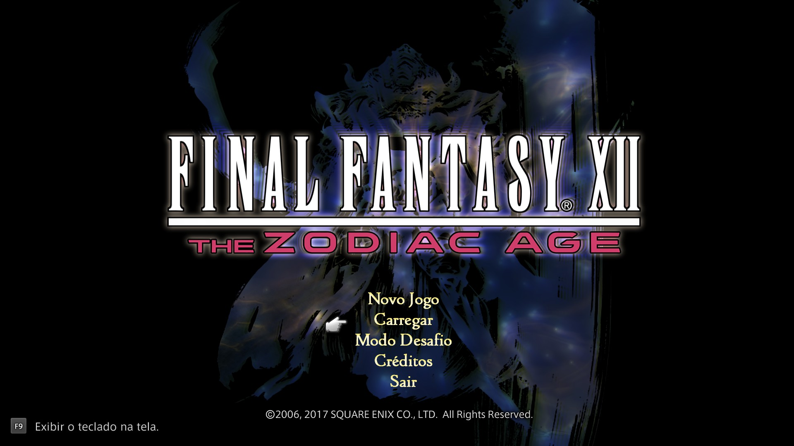
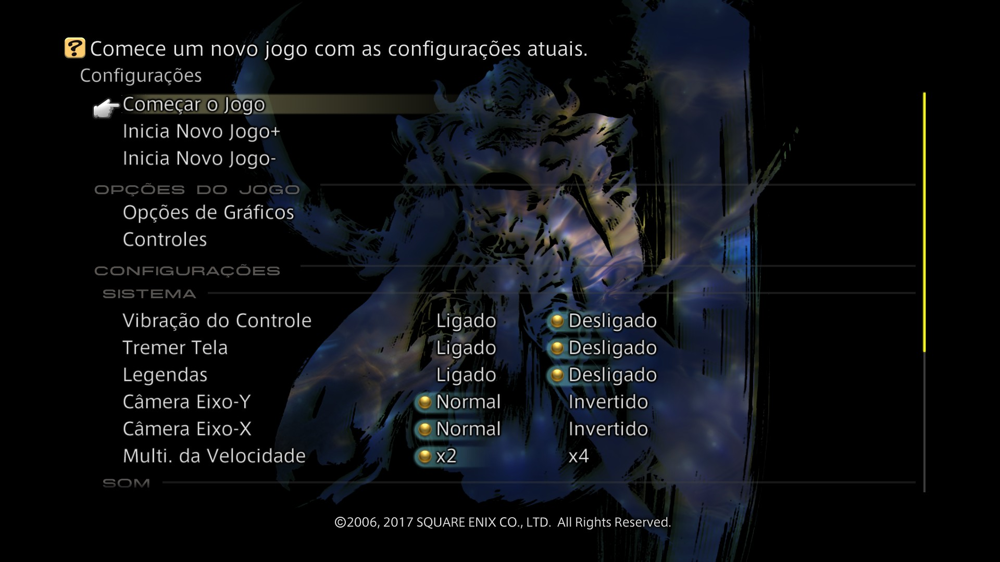

# FINAL FANTASY XII THE ZODIAC AGE - Tradução PT-BR

Repositório público para distribuição da tradução PT-BR de `FINAL FANTASY XII THE ZODIAC AGE`.

## Versões de download

### Automática `r1` (recomendada)

Instalador automático legado.

- arquivo: `FF12_PTBR_Installer_v1.8.0-r1.zip`
- extra: `FF12_PTBR_Installer_v1.8.0-r1.exe`
- indicada para quem quer a instalação mais simples

### Manual `r3` (alternativa)

Pacote manual para uso com `FF12 External File Loader`.

- arquivo: `FF12_PTBR_v1.8.0-r3.zip`
- formato: somente arquivos da tradução
- indicada para quem prefere instalar manualmente

> Aviso: a versão `r1` pode gerar mais alertas heurísticos por ser um executável empacotado.

## Vídeo de instalação

Se você preferir acompanhar o processo em vídeo, aqui está o tutorial mostrando a instalação automática:

- [Assistir no YouTube](https://www.youtube.com/watch?v=QzFkaFCr_fI)

## Capturas da tradução

### Menu principal traduzido

### Configuração de legendas

## Como instalar

### Automática `r1`

1. Extraia `FF12_PTBR_Installer_v1.8.0-r1.zip`.
2. Execute `FF12_PTBR_Installer_v1.8.0-r1.exe`.
3. Use a opção de instalar ou remover dentro do instalador.

> Importante: para as legendas aparecerem traduzidas durante as cenas, a opção **Legendas** precisa estar ativada nas configurações do jogo.

### Manual `r3`

#### 1. Instale o FF12 External File Loader

Baixe e instale o `FF12 External File Loader` antes da tradução manual.

Link do loader:
- [FF12 External File Loader no Nexus Mods](https://www.nexusmods.com/finalfantasy12/mods/170)

Depois da instalação, confirme se estes arquivos existem dentro da pasta do jogo:

- `x64\dinput8.dll`
- `x64\modules\ff12-file-loader.dll`

Se o jogo não abrir ou se o loader não funcionar, instale ou repare o:

- `Microsoft Visual C++ Redistributable (x64)`

#### 2. Extraia a tradução manual

Extraia `FF12_PTBR_v1.8.0-r3.zip` em uma pasta temporária qualquer.

Dentro dela, você deve encontrar a pasta:

- `ff12data`

#### 3. Copie a tradução para a pasta certa

Entre na pasta do jogo e, se ainda não existir, crie:

- `mods`
- `mods\deploy`

Agora copie a pasta `ff12data` extraída para dentro de `mods\deploy`.

O resultado final precisa ficar exatamente assim:

`FINAL FANTASY XII THE ZODIAC AGE\mods\deploy\ff12data`

#### 4. Abra o jogo

Abra o jogo normalmente pelo Steam.

> Importante: para as legendas aparecerem traduzidas durante as cenas, a opção **Legendas** precisa estar ativada nas configurações do jogo.

#### 5. Se a tradução não aparecer

Confira estes pontos com calma:

1. O loader foi instalado e os arquivos abaixo existem:
   - `x64\dinput8.dll`
   - `x64\modules\ff12-file-loader.dll`
2. A pasta final ficou exatamente em:
   - `mods\deploy\ff12data`
3. A pasta não ficou duplicada por engano, por exemplo:
   - `mods\deploy\FF12_PTBR_v1.8.0-r3\ff12data`
4. O jogo foi fechado antes de copiar os arquivos.
5. As legendas estão ativadas nas configurações do jogo, caso você queira ver as falas durante cenas.

## Sobre este repositório

Os binários de release não devem ser commitados no Git normal do GitHub porque são grandes demais para o repositório comum.  
Por isso, este repositório foi preparado para:

- versionar documentação, notas e hashes;
- enviar os arquivos grandes em **GitHub Releases**;
- manter a versão automática `r1` e a manual `r3` como assets de release.

## Arquivos de apoio

- [Hashes dos assets](docs/ASSET_HASHES.md)
- [Checklist de release no GitHub](docs/GITHUB_RELEASE_CHECKLIST.md)
- [Notas de release](docs/RELEASE_NOTES.md)
